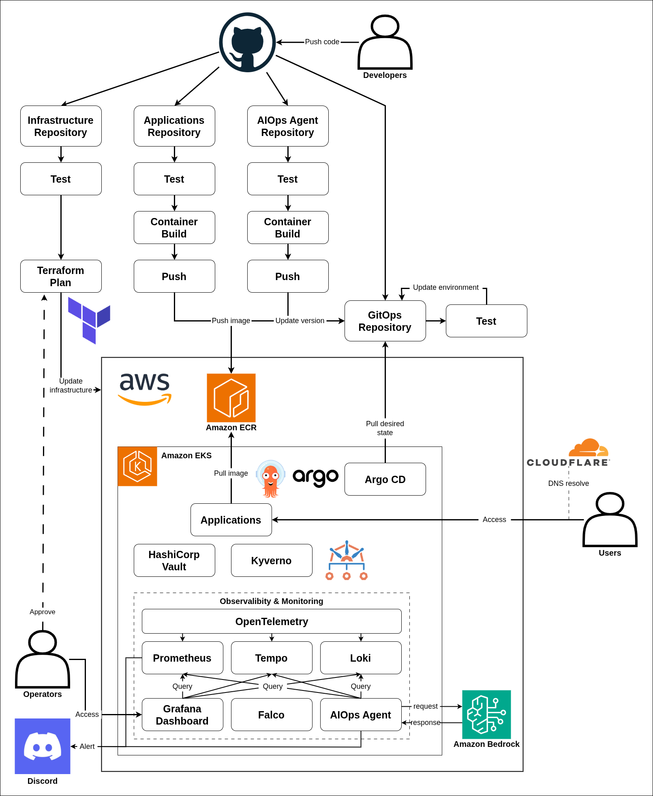
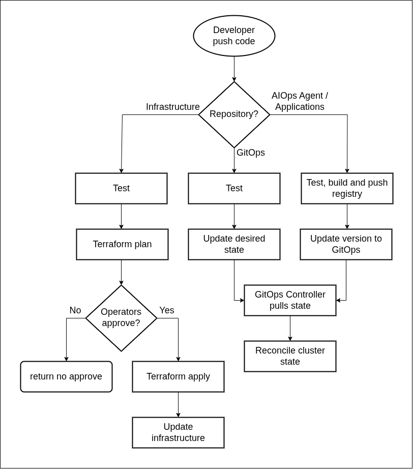

# Nexus Platform

A cloud-native platform for securely building, delivering, and operating microservices on AWS.

## About

Nexus Platform is a cloud-native deployment platform for microservices on AWS with infrastructure automation, GitOps delivery, supply-chain security, progressive delivery, observability and an LLM-based AIOps agent.

The platform provides an end-to-end delivery pipeline from code changes to production deployment. It is designed to minimize vendor lock-in by using portable, open standards across its core delivery and operations layers. It combines IaC, CI/CD, GitOps, observability and AI-assisted operations within a DevSecOps model.

## Core Capabilities

- **Infrastructure automation**: Provisions the cloud resource with Iac and automates with CI/CD pipelines.
- **Secure delivery**: Validates, scans, signs and promotes container images through delivery pipelines.
- **GitOps operations**: GitOps controller for continuously reconcile Kubernetes workloads and platform services.
- **Observability**: Provides metrics, logs, traces, dashboards and alerts across the platform.
- **AIOps agent**: Analyzes incidents and alert RCA to notification.

## Architecture

<p align="center">
  
</p>

<p align="center"><em>High-level Nexus Platform architecture</em></p>

External traffic passes through the edge and gateway layers before reaching the application services. Telemetry flows into the observability stack, while the monitoring agent analyzes incidents and reports its findings to operators. Terraform provisions cloud resources and Argo CD reconciles Kubernetes state.

## Repositories

| Repository | Responsibility |
| --- | --- |
| nexus-app | Microservices Application and CI/CD pipelines with tests, build, publish and release |
| nexus-monitoring-agent | AIOps agent for incident analysis and notifications |
| nexus-infra | Terraform-managed AWS infrastructure |
| nexus-gitops | Kubernetes desired state, platform services and application delivery |

### Nexus App

[`nexus-app`](nexus-app/) contains the Auth and Profile services. It owns the application code, tests, container images and release automation that updates the development GitOps state.

### Nexus GitOps

[`nexus-gitops`](nexus-gitops/) is the Kubernetes source of truth. It configures the platform services, application, security policies and environment-specific desired state reconciled by Argo CD.

### Nexus Infra

[`nexus-infra`](nexus-infra/) provisions the AWS foundation with Terraform. It owns the network, EKS, data services, IAM and edge resources required by the platform.

### Nexus Monitoring Agent

[`nexus-monitoring-agent`](nexus-monitoring-agent/) is an AIOps agent analyzes monitoring incidents, gathers operational context and sends action suggestions to notification channel.

## Delivery Workflow

<p align="center">
  
</p>

<p align="center"><em>High-level delivery and operations flow</em></p>

1. A change is merged into an application or the monitoring agent.
2. CI validates the change and publishes an immutable, signed container image.
3. Automation opens a GitOps pull request with the new image version.
4. Argo CD reconciles the merged state to the development cluster.
5. A validated release is promoted to production, where Argo Rollouts performs a monitored canary deployment.

Infrastructure follows its own Terraform workflow: pull requests are planned and reviewed before approved changes are applied.

## Quick Start

### Prerequisites

- AWS and GitHub accounts
- AWS CLI, Terraform, kubectl, and Helm
- A registered domain name

### Deployment

1. Clone the repository with its submodules:

   ```bash
   git clone --recurse-submodules https://github.com/nguyentin05/nexus-platform.git
   ```

2. Provision the Terraform state backend and ECR, then apply shared and environment infrastructure from `nexus-infra`.
3. Bootstrap Argo CD and its root Application from `nexus-gitops`.
4. Initialize Vault and load approved runtime secrets through the documented workflow.
5. Allow Argo CD to reconcile platform services and application workloads.

Read the component README before performing any cloud-mutating command.

## License

Licensed under the [Apache License 2.0](LICENSE).
